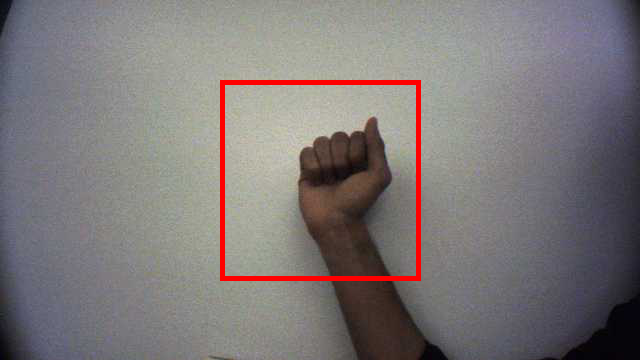

# Overview:

This project passes the robot's camera feed through a [Convolutional Neural Network](https://en.wikipedia.org/wiki/Convolutional_neural_network) (CNN) built to recognize American Sign Language hand signs. The network is built using [Keras](https://keras.io/) with a [TensorFlow](https://www.tensorflow.org/guide/keras) Backend. It predicts the sign visible (if any) per frame and therefore cannot predict more complex sign language gestures.

>Network Architecture:
>ConvLayer -> MaxPoolLayer -> ConvLayer -> MaxPoolLayer -> ConvLayer -> Dropout -> Flatten -> Dense -> Dropout -> Dense

The network is built as a Keras [Sequential](https://keras.io/getting-started/sequential-model-guide/) model which consists of a linear stack of layers of the following types:

ConvLayer (Convolutional layer): https://keras.io/layers/convolutional/

MaxPoolLayer (Max Pooling layer): https://keras.io/layers/pooling/

Flatten, Dense, Dropout layers: https://keras.io/layers/core/

The `data_gen.py` script can be used to build/expand the dataset to train and test the model. Each image captured is used to generate a multiplier number of other images to expand the dataset. The images are translated to 200x200 black and white images to reduce the complexity of the network. While capturing images from the feed ensure that your hand is positioned within the red square which represents the cropped image dimensions.

>Note: This project has not been tested on Windows and Linux environments. Currently the `data_gen.py` script will not run on Windows due to its dependency on the `curses` library.


# Additional Dependencies:

Install the additional dependencies required for the project:
```
pip3 install keras
pip3 install numpy
pip3 install scipy
pip3 install scikit-learn
pip3 install tensorflow
```

# Dataset:

### Import Dataset:

This project includes a sample dataset that can be used as a starting point to train and test the neural network.

Unpack the dataset:
```
unzip dataset.zip
```

>Note: This dataset contains 200x200 black-and-white images of two hand signs ("a", "b"). Additionally, the `stats.json` file provides the number of images of each alphabet type.

### Generate Dataset:



Use the following command to capture more images and expand the dataset. Expanding the dataset to include more images can help improve the network's performance since:

	1. The network may not have seen any reference images to help distinguish your background. Especially if you are testing against a noisy background.

	2. The dataset only contains images of the same hand and might not identify others that look significantly different.


```python3 data_gen.py --dataset_root_folder <path_to_folder>```

>Note: In order to capture an image, display the hand sign within the red frame on the camera feed displayed and press the key corresponding to the label representing the hand sign. Dimensions of images in the dataset are 200x200.

>Note: Along with capturing images of hand signs it is also important to capture images of the background without any hand sign in the frame. This ensures that while predicting a frame without any hand signs, it is correctly classified. Use the space bar on your keyboard to record a background image.


# Run Project:

### Project Phases:

There are two main phases: `train` and `predict`. In the training phase, the neural network is given a set of labeled hand sign images. Once the network has been trained to classify the images we move to the prediction phase. The `predict` option launches the robot's camera feed and looks to classify any visible hand signs. If a frame is classified the recognized letter is spoken out loud.

### Training:

Train the neural network using an image dataset to classify different hand signs.

```
python3 recognizer.py --train --dataset_root_folder <path_to_folder> [--model_config <path_to_config_file>] [--model_weights <path_to_weights_file>]
```

>Note: Use the `model_config` and `model_weights` flags to save the model's configurations after it has been trained. This way the model does not need to be re-trained before predicting.

### Prediction:

Use a trained neural network to predict any visible hand signs in the robot's field of view (within the region of interest marked with a red square).

```
python3 recognizer.py --predict --model_config <path_to_config_file> --model_weights <path_to_weights_file>
```

>Note: Use the `model_config` and `model_weights` flags to load an existing model's configuration. If not using an existing model's configuration, train the model first.

### Train and Predict:

```
python3 recognizer.py --train --predict --dataset_root_folder <path_to_folder>
```