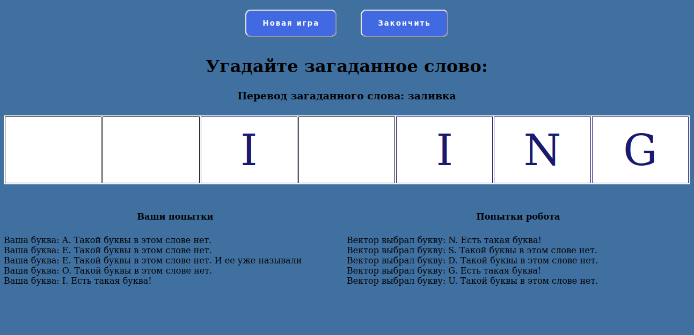

# Wheel of Fortune (Guess the word Game) with Vector



## The point of the game.

You get a random word in English. You need to guess it, and your Anki Vector Robot will help you.
You see a number of empty cells by the number of letters of the hidden word, as well as its translation into Russian.
Your move: enter the selected letter using the keyboard.
Then Vector will make his move and name the letter he has chosen.
There are no scores and losers in the game, but rest assured, Vector will be very happy if he guesses the last letter.

Learn more about Vector: https://www.anki.com/en-us/vector

Learn more about the SDK: https://developer.anki.com/

## How to use the app

0. If you haven't set up your Vector yet and don't know how to do it, follow all
[instructions](https://developer.anki.com/vector/docs/index.html).
Also create and run a virtual environment for game project and download the requirements:
```
python3 -m venv venv
source venv/bin/activate
pip install -r requirements.txt
```

1.  You should create an .env file in the game directory and put the following values in it:

```
FLASK_SECRET_KEY = wefbewjhb67t6uew
RANDOM_WORD_KEY = hevfhjew78y87wefhjbmbwetrgjkbntr
RAPID_API_KEY = 345t76ebwfjlefwjeefwefcwef23rf23rwedeqd
```
___Do not use these keys, they are given only as an example and will not work___

2. FLASK_SECRET_KEY must be created manually.
There are many ways, one of them is to use the following code in the Python Console:

```python
import os
os.urandom(12)
```

3. RANDOM_WORD_KEY - API key to getting a random English word to be guessed.
You need to register [here](https://api-ninjas.com/register), confirm your email and log in.
Then you can see API key in [your profile](https://api-ninjas.com/profile) - just use the Show API Key button.
Copy it to your .env file into the appropriate variable.
You can get 50,000 words per month for free.

4. RAPID_API_KEY - API key to getting a translation of a random hidden word.
It will be given for free after registration on the [rapidapi.com](https://rapidapi.com/) 
(you can use your Google account). Then follow 
[Microsoft Translator Text](https://rapidapi.com/microsoft-azure-org-microsoft-cognitive-services/api/microsoft-translator-text/).
Click Subscribe to Test and select a free plan. Then return to the API page and 
find on the page the __X-RapidAPI-Key__ and copy its value to your .env file into the appropriate variable.
You can get 500,000 characters per month for free.

5. Use
```
python3 run.py
```
in terminal or run the run.py file in any convenient way.

### I hope your Vector likes the new game!


## Privacy Policy and Terms and Conditions
You can do what you want with my game without violating the law.
Use of Vector and the Vector SDK is subject to Anki's [Privacy Policy](https://www.anki.com/en-us/company/privacy) and [Terms and Conditions](https://www.anki.com/en-us/company/terms-and-conditions).
